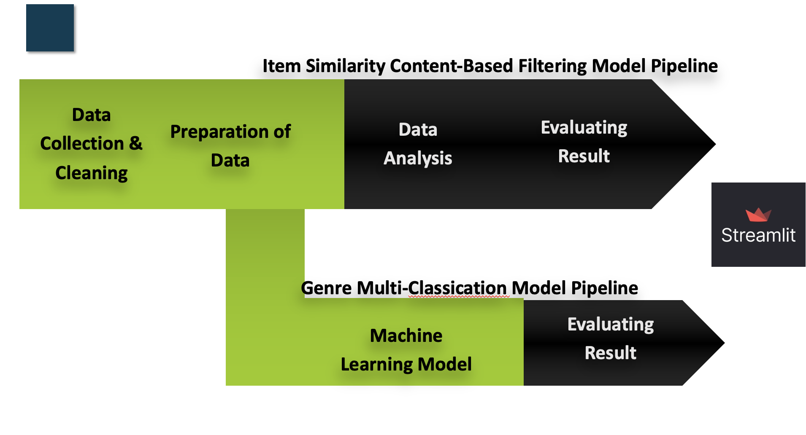
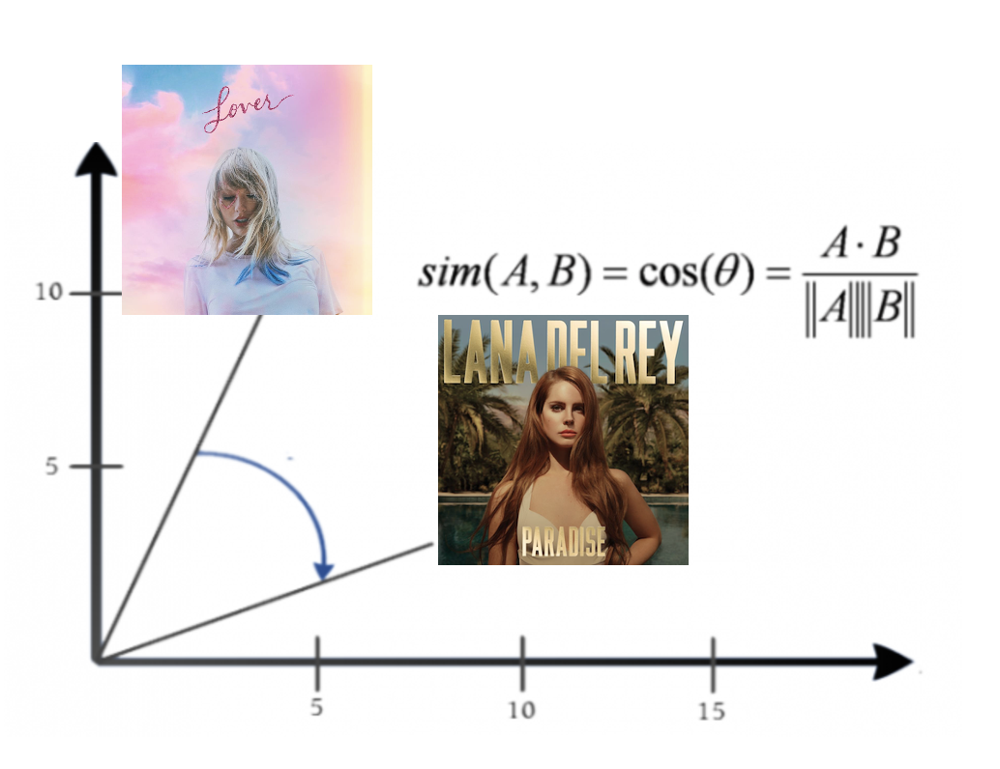
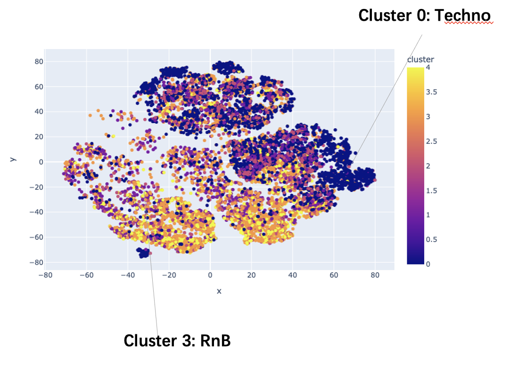
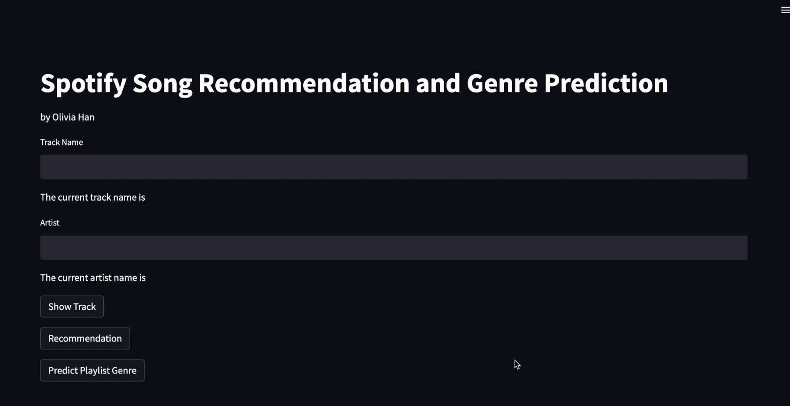

# Spotify  Recommendation System with Lyrics Sentiment and Playlist Genre Classifier

## Authors

Olivia Han

## Description

This project developed an app that will generate a playlist consist of 20 unique songs based on one track chosen by user and then predict the overall genre for that playlist. 
This is a item cosine similarity content_based recommandation system for Spotify. It is enhanced with lyrics sentiment analysis.


## Work Flow




## 1. Content-Based Filtering Recommendation Engine

### Data Extraction

* Spotify API & Spotipy: Audio and track information Features:
    * Audio Features: Danceability,Acousticness,Energy, Instrumentalness, Liveness, Loudness, Speechiness, Tempo, Valence
    * Track Info:
    Release year, Author Genres
* Genius API & LyricsGenius:
    * Lyrics


### Lyrics Sentiment Analysis

* Use a pre-trained Sentiment Analyser to classify the lyrics mood to be positive or negative


```
rom nltk.sentiment.vader import SentimentIntensityAnalyzer
```

### Recomendation System
* Cosine similarity to calculate the cosine angle between two song project.
* The higher the score, the closer and the more similar two songs are.



## 2. Genre Classification Model
* 11 unique genres with 10 audio features



## Model Comparison
* Logistic Regression
* Decision Tree Classifier
* XGBoost Classifier
* Random Forest Classifier

Use imbalanced Pipeline, PCA, to construct a 0.79 accuracy score Random Forest Classifier with 0.8 F1 Score. 


## Model Deployment
* use streamlit to deploy the system



## Acknowledgments

Inspiration, code snippets, etc.

Building A Spotify Recommendation Engine With Python : https://www.youtube.com/watch?v=tooddaC14q4 

The Most Favorable Pre-trained Sentiment Classifiers in Python: https://towardsdatascience.com/the-most-favorable-pre-trained-sentiment-classifiers-in-python-9107c06442c6 

t-SNE: https://towardsdatascience.com/visualising-high-dimensional-datasets-using-pca-and-t-sne-in-python-8ef87e7915 